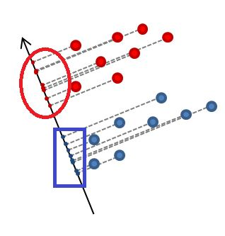

# The intuition behind the Linear Discrimination Model - DevOps edition

Linear Discrimination Model (aka:  Linear Discriminant Analysis/LDA) was invented by Sir Ronald Fisher in 1936. It is related to variance analysis (ANOVA) and regression. \
Although it is a simple and classical linear model, which hasn't been that popular anymore compared with other sophisticated machine learning models, the mathematical approach behind this model, however, is fascinating. \
Let's dive into it.

### Classification and Dimension reduction

<figure><figcaption>
What is classification?
</figcaption></figure>

Dimension reduction is generally considered as preprocessing step when constructing a classification model.\
We don't need to memorize every detail of Batman in order to tell that he is not Captain America.\
Instead, we can just recognize that the colour scheme of Captain America is red and blue, but Batman is black instead.\
When designing a machine learning model, we would also like it to capture the essential "unique identifiers" between two classes to avoid overfitting.  The generlization capability follows Occams' Razor principle.


Occams' Razor: "**entities should not be multiplied beyond necessity**"


<figure><figcaption>
Red and black samples in the Cartesian coordinate system
</figcaption></figure>

Let's look at this example. There are some red and black dots in two-dimensional coordinate systems. X and Y axis are used to recode their location in the space.\
By using Occams' Razor principle, we could possibly just use one axis to record these points, which is sufficient for us to deliver our objective (classification).

Since X and Y values are these points' projections on one axis respectively, we can use find one axis to be the new projection baseline.

<figure><figcaption>
Is this Z axis sufficient?
</figcaption></figure>

This Z axis is not the candidate as the red and black projections are clustered together.

### App design and data integration

<figure><figcaption>
Monolithic Architecture
</figcaption></figure>

Monolithic architecture is a traditional, self-contained application. It is very easy to be deployed and relatively simple to be developed. The load balancer can be deployed to increase scalability.

<figure><figcaption>
Monolithic with load balancer
</figcaption></figure>

However, the drawback of monolithic architecture is significant as well.\
Considering we have 500 clients interacting with our E-Commerce application, 200 of them add items to the shopping cart. 50 of them find the discount code and 75 orders have been placed at the end.\
With the load balancer, the application can be scaled out to serve the peak demand of 500 clients. These 500 instances will all provide UI, product catalogue, shopping cart, discount and order services, although we only need 50 discount services and 75 order services at the end.\
These redundancy services introduce unnecessary latency, overhead communication and resource usage.

<figure><figcaption>
E-commerce microservice example
</figcaption></figure>

Around 2011, the modern microservice architecture was created aiming to resolve this bottleneck.\
The idea is very straightforward. The business logic is broken into different functional components. These functional components are called microservice. In our aforementioned example, only 200 of shopping cart services, 50 discount services and 75 ordering services will be spinning up to serve clients' needs.\
This is a highly efficient and well-organized architecture.\

<figure><figcaption>
Highly cohesive and Loosely coupled
</figcaption></figure>


**" Coupling " describes the relationships between modules, and " cohesion " describes the relationships within them**.&#x20;


In microservice, the related code of the same module/class is connected together as close as possible while the code between different modules/classes should be independent as far as possible.&#x20;

### Coupling and Cohesive in Linear Discrimination Model

Now you may be curious, why does this have anything to do with Linear Discrimination Model?\
Let's find the coupling and cohesive definition in LDA.

#### Highly Cohesive

<figure><figcaption>
Cohesive in LDR
</figcaption></figure>

&#x20;As Cohesive refers to the tight relationships within the class, we want the red dots after projection to cluster together and the same as the blue dots.


variance is **a measure of dispersion that takes into account the spread of all data points in a data set.**


Mathematically, the variance can illustrate our objectives. Basically, we want the variance of each class as small as possible which represent all the points converging to its center (mean).

<figure><figcaption>
variance
</figcaption></figure>

$$
{s_{1}+s_{{2}}}
$$

Highly Cohesive means we want the variance of both class 1 (red dots) and class 2 (blue dots) to be as large as possible

#### Loosely Coupled

<figure><figcaption>
Loosely Coupled
</figcaption></figure>

The distance between two classes, after projects, represents the relationship between these two classes. We want this distance to be as large as possible, so we square the distance to ignore the negative value after the deduction.

$$
\left(\bar{z}_1-\bar{z}_2\right)^2
$$

#### Final Objective function

<figure><figcaption></figcaption></figure>

Combining these two objectives together, we can form our final objective function, which achieves both cohesion and coupling together.

$$
\frac{\left(\bar{z}_1-\bar{z}_2\right)^2}{s_{1}+s_{{2}}}
$$

By minimizing this objective function, we can achieve our main objective.&#x20;
