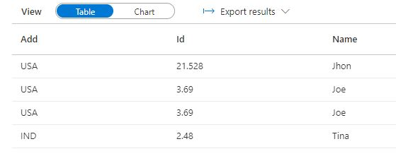

# Pyspark Case Senstivity

Unlike Python, Pyspark does case insenstive column header resolution.

Let's create a dataframe

```
data1 = [{'Name':'Jhon','Id':21.528,'Add':'USA'},{'Name':'Joe','Id':3.69,'Add':'USA'},{'Name':'Joe','Id':3.69,'Add':'USA'},{'Name':'Tina','Id':2.48,'Add':'IND'}]
a = sc.parallelize(data1)
b = spark.createDataFrame(a)
display(b)
```



We apply the filter to name and Id columns, but instead, we called Id: ID.

```
c=b.select("name","ID")
display(c)
```


As you can see, the column has been renamed to ID in the new dataframe.\
Select transformation function not only applies case insenstive filtering, but also renames the column header in the new dataframe after transformation.

Case sensitivity is set to false by default. We can enable it by turning it on in the spark-session .

```
spark_session.sql('set spark.sql.caseSensitive=true')
```
